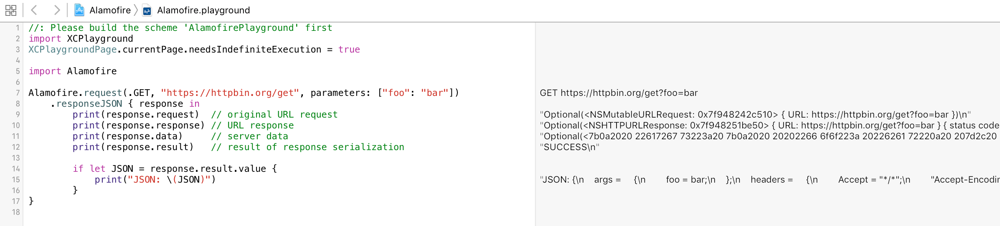

# This Could Be Us But You Playing

Generates a Swift Playground for any Pod.

## Installation

    $ gem install cocoapods-playgrounds

## Usage

### CocoaPods

To generate a Playground for a specific Pod:

    $ pod playgrounds Alamofire

To generate a Playground for a local development Pod:

    $ pod playgrounds ../../../Sources/Alamofire/Alamofire.podspec

To generate a Playground with multiple Pods:

    $ pod playground RxSwift,RxCocoa

### CLI

To generate an empty Playground from the commandline:

    $ playground --platform=ios YOLO
    $ open YOLO.playground
